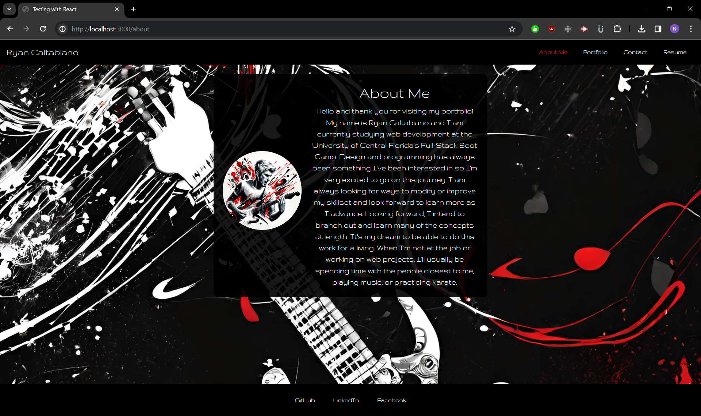
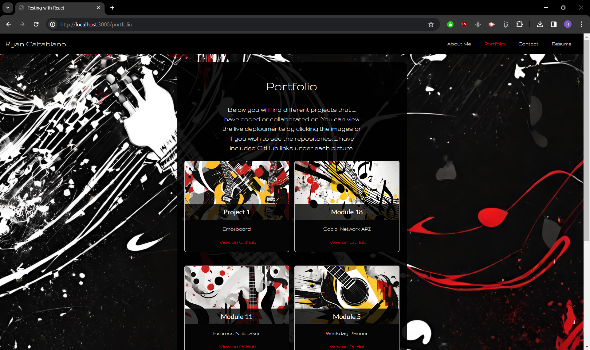

# React Portfolio - Ryan Caltabiano

(https://opensource.org/licenses/MIT)

## Table of Contents

1. [Description](#description)
2. [Installation](#installation)
3. [Usage](#usage)
4. [Contributors](#contributors)
5. [License](#license)
6. [Link](#link)
7. [Screenshots](#screenshots)
8. [Questions](#questions)

## Description

This project is a personal portfolio written using React. This was actually an interesting and exciting project to work on for me because this is something I had wanted to do on my own. React offers a lot of flexibility in designing dynamic web pages with faster loads while maintaining consistency and structure throughout the application. React is a very well known and used framework for writing robust web pages and it was something I really wanted to make sure I understood and will continue to practice and develop my skillset with this going forward. I had a lot of fun doing this project and I learned a great deal about interaction between elements, scripts, app structure, and writing dynamic code allowing me to insert automatically styled elements and containers when I add new objects. I tried to challenge myself with this one to do a few things I hadn't known that came to mind and I also learned more about the bootstrap framework and how their styles interact with each other. Both were fun to learn and even though I encountered several issues in the process, I enjoyed the experience.

## Installation

N/A

## Usage

Using this project is straightforward. After entering the page, navigate the links to view the content. I provided steps explaining how to interact on each page.

## Contributors

Canva image generator was used to create the image links and avatar.
Font was sourced from The Gruppo Project Authors (https://github.com/googlefonts/GruppoFont)

## License

This project is licensed under the [MIT License](https://opensource.org/licenses/MIT) - see the license file for details.

## Link

[Netlify](Link to go here)

## Screenshots

## Questions

If you have any questions or would like to see my work, you can visit my GitHub portfolio: [Ryan9698](https://github.com/Ryan9698).

or reach me by email: [rcaltabiano90@gmail.com](mailto:rcaltabiano90@gmail.com).

